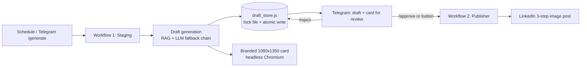

# Architecture

```mermaid
flowchart LR
  S[Schedule / Telegram /generate] --> W1[Workflow 1: Staging]
  W1 --> G[Draft generation<br/>RAG + LLM fallback chain]
  G --> Q[(draft_store.js<br/>lock file + atomic write)]
  G --> C[Branded 1080x1350 card<br/>headless Chromium]
  Q --> T[Telegram: draft + card for review]
  T -->|/approve or button| W2[Workflow 2: Publisher]
  W2 --> L[LinkedIn 3-step image post]
  T -->|/reject| Q
```

See `docs/adr/` for the decisions behind the split (ADR 0004), approval model (ADR 0001, 0006) and tunnel (ADR 0002).
